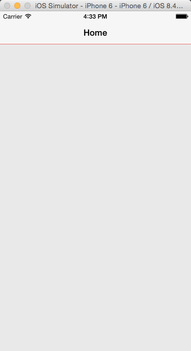

# TQNavigationBarUnderLine
Easy way to set under line for UINavigationBar

##Demo



##Usage

set color

	```objective-c

	[self.navigationController.navigationBar ul_setUnderLineColor:[UIColor redColor]];

	```
	
reset

	```objective-c

	[self.navigationController.navigationBar ul_reset];

	```
	
