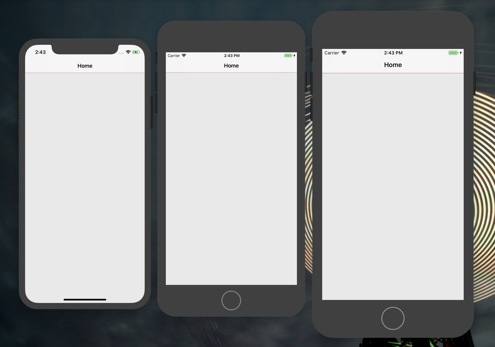

# TQNavigationBarUnderLine

[](https://cocoapods.org/pods/TQNavigationBarUnderLine)
[](https://cocoapods.org/pods/TQNavigationBarUnderLine)
[](https://cocoapods.org/pods/TQNavigationBarUnderLine)

Easy way to set under line Color for UINavigationBar (iOS7 available) .

## Example




## Installation

TQNavigationBarUnderLine is available through [CocoaPods](https://cocoapods.org). To install
it, simply add the following line to your Podfile:

```ruby
pod 'TQNavigationBarUnderLine'
```

## Usage

import

```objective-c

#import <TQNavigationBarUnderLine/TQNavigationBarUnderLine.h>
// or
@import TQNavigationBarUnderLine;

```

set

```objective-c

[self.navigationController.navigationBar ul_setUnderLineColor:[UIColor redColor]];

```

remove

```objective-c

[self.navigationController.navigationBar ul_reset];

```

## Author

tinyqf@gmail.com

## License

TQNavigationBarUnderLine is available under the MIT license. See the LICENSE file for more info.
